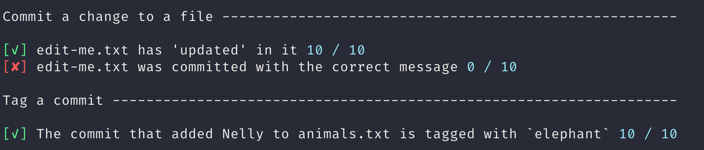

GitRuler provides exercises with continual feedback to students when they successfully use git to complete them. It allows students to explore and learn git and can be used to assess their performance.

# Show me

Learners clone a repository that contains instructions for an exercise:

```markdown

# Commit a change to a file

1. Add the text "updated" to the bottom of `files/edit-me.txt`
2. Commit that update with the messages "Add updated to edit-me.txt"

# Tag a commit

3. Find the id of the commit that added the text "Nelly" to the `files/animals.txt`
4. Tag that commit with the tag name "elephant"

```

The student tries to complete the exercise

```bash
echo "updated" >> files/edit-me.txt
git add files/edit-me.txt
git commit -m "Change file"
git log files/animals.txt
git tag elephant 26112fa05
```

GitRuler will given instant feedback on whether they have completed each step:



Oh, they didn't give the correct message when committing the file. Hopefully they've learned now.

# Try it

1. Download `gitruler.jar` from our [Github releases page](https://github.com/rcraggs/gitruler/releases/latest). Save this somewhere you'll remember (e.g. a `home` or `bin` directory).
2. Clone an example repository. e.g. `git clone https://github.com/UOL-CS/gitruler-practice-a-c.git`.
3. `cd` into the cloned repository e.g. `cd ~/git/gitruler-practice-a-c`.
4. Run GitRuler `java -jar <path>/gitruler.jar`.
5. Complete the exercise, occasionally running GitRuler to check your progress.

# Student Testimonials

**82%** students prefer GitRuler to other similar undergraduate teaching[^1]
**88%** students learn better from GitRuler than other git tutorials

- _"I find this method of learning git to be fantastic"_
- _"It's a good learning tool. Fairly easy to use once you get the hang of it"_
- _"Gitruler was useful as it showed what needed to be done and gave instant feedback in regards to whether it was completed satisfactorily"_


# How to Teach using GitRuler

GitRuler helps students learn on the principle that people learn better by applying techniques to solve problems than by following explicit instructions.

## A possible teaching workflow

1. Introduce the concepts of source control and git through a tradition lecture.
2. Provide instructions and support for downloading and running GitRuler.
3. Direct students to [repositories of exercises](https://github.com/UOL-CS/gitruler-exercises) to work through as homework or in class time.

## Assessing students using GitRuler

GitRuler can automatically calculate scores based on student skills. It is easy to create new GitRuler exercises. A possible workflow for automatically graded git tests:

1. Create a repository for each student containing an unseen GitRuler exercise (this may or may not contain the file that allows students to check their own progress).
2. Students complete the exercises as homework or under test conditions.
3. When they finish they push their repository.
4. The teacher clones each repository and runs GitRuler against it to calculate their grade.

(Scripting tools that integrate with Github like [Gitomator](https://gitomator.github.io/) make these steps quick)

# GitRuler Exercises

A exercise contain 3 parts:

1. A "starter" git repository in which the student will execute git commands.
2. A rules file in json format that describes the checks that GitRuler will run on the repository.
3. Instructions for the student to complete the exercise (usually a readme.md file in the repository mentioned above)

Here is an example: [GitRuler Practice Exercise](https://github.com/UOL-CS/gitruler-practice-a-c)

## Writing your own exercise

To create an exercise you must create each of the three things mentioned above. The "technical" part is writing the rules in JSON format. Instructions on the format of the file and the rules and parameters are on the [GitRuler GitHub page](https://github.com/rcraggs/gitruler/).

Things that GitRuler can do include:

1. Creating and editing files before the exercise beings to set things up (e.g. editing a file ready for committing).
2. Check files were committed with the right message
3. Check that commits that edited certain files were tagged with a certain tag.
4. Check that files were added in a certain branch


[^1]: A survey of 17 students using GitRuler as part of an undergraduate course.